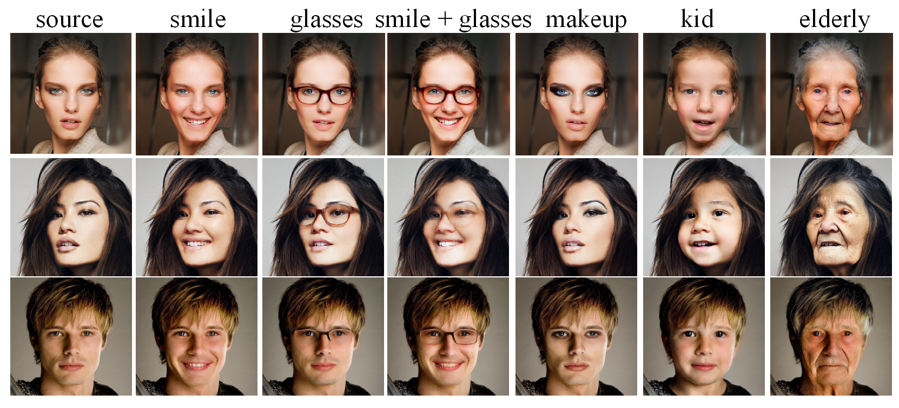
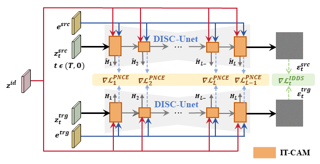
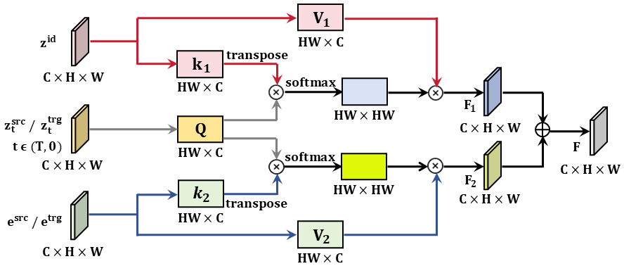
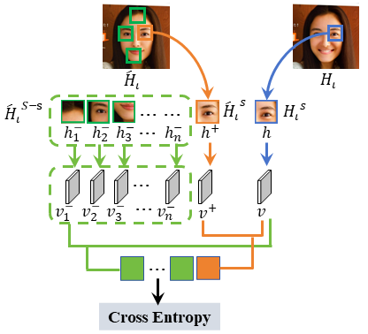

# Identity Preservation and Facial Structure Consistency in Text-Guided Face Editing via Diffusion Models

## Code is coming soon!

## 📌 Abstract

Facial image editing has achieved significant progress in terms of generation quality and diversity.  However, preserving identity and maintaining facial structure consistency remains a challenging task during text-guided facial attribute editing.  This paper proposes DISC-Face, a novel framework based on the Stable Diffusion model to address these limitations.  Specifically, DISC-Face framework proposes  DISC-Unet network, in which an Identity-Text-conditioned Cross Attention Mechanism (IT-CAM) is designed at each layer to effectively fuse identity features with textual description. To further enhance editing performance, a hierarchical loss framework is proposed, comprising: an ID loss for enhancing to preserve identity, a Patch Noise Contrastive Estimation (PNCE) loss for structural consistency, and an Identity-Distinguishable Denoising Score (IDDS) loss that jointly consider to preserve identity and maintain facial structure consistency under text-guided conditions. Experimental results on the CelebA-HQ and FFHQ datasets demonstrate that DISC-Face achieves improvements of 25% in identity preservation, 30% in structural consistency, and 40% in generation quality, while reducing perceptual artifacts by 50%. Furthermore, it exhibits superior overall visual naturalness while maintaining comparable text-image alignment. This paper offers a novel approach to facial attribute editing, with potential applications in visual effects, privacy protection, and other domains.

Keywords: Text-Guided Face Editing, Identity Preservation, Facial Structure Consistency, Stable Diffusion

<figure>
    
    <figcaption>Fig. 1. Our Results. Disc-Face satisfies challenging text description that include diverse attribute
conditions while preserving the identity and facial structure consistency of the input face.</figcaption>
</figure>

## OverView

<figure>
    
    <figcaption>Fig. 2. Overview of Identity-Preserving and Structure-Consistent Text-Guided Face Editing via
DISC-FACE.</figcaption>
</figure>

<figure>
    
    <figcaption>Fig. 3. DISC-Net Network Architecture.</figcaption>
</figure>

<figure>
    
    <figcaption>Fig. 4. IT-CAM Network Architecture.</figcaption>
</figure>

<figure>
    
    <figcaption>Fig. 5. PNCE Loss Calculation Process.</figcaption>
</figure>

## 🚀 Environment Setup

### Clone this repository

```bash
git clone https://github.com/AnnaFace/DISC-Face.git 
cd DISC-Face
```

### Requirements

```bash
conda install pytorch==2.1.1 torchvision==0.16.1 torchaudio==2.1.1 pytorch-cuda=11.8 -c pytorch -c nvidia
pip install diffusers==0.16.1 
pip install transformers==4.32.1
```

## ⬇️  Pre-trained Diffusion Models and Datasets

Our method works on pre-trained diffusion models. The pre-trained models is built on top of [Stable Diffusion](https://github.com/CompVis/latent-diffusion).

The datasets used in our experiments are **FFHQ** (Flickr-Faces-HQ) for training and **CelebA** for evaluation. Below, you can find more details about each dataset and instructions for how to access them.

The **FFHQ** dataset consists of 70,000 high-resolution (1024×1024) facial images, covering a wide range of variations in age, gender, ethnicity, and background. Each image is meticulously annotated with 40 facial attribute labels, such as expressions, hairstyles, and accessories.

To download the FFHQ dataset, please visit the following link:

[FFHQ Dataset](https://github.com/NVlabs/ffhq-dataset)

The **CelebA** dataset is used for evaluation and contains 202,599 celebrity facial images, each annotated with 40 binary attribute labels. Attributes include features such as smiling, wearing glasses, and having blonde hair.

To download the CelebA dataset, please visit the following link:

[CelebA Dataset](http://mmlab.ie.cuhk.edu.hk/projects/CelebA.html)

## 🎨  Usage

To perform **fine-tuning and evaluation** using our method, we provide an executable script run.py, which takes a facial image and corresponding source/target text description as input. This script enables users to both adapt the model to specific editing tasks and evaluate its performance under controlled conditions.

The following command demonstrates how to apply **text-guided fine-tuning and attribute manipulation** on a given image:

```bash
python run.py --img_path sample/25.jpg --prompt "a woman" --trg_prompt "a smile woman" --w_cut 3.0 --patch_size 1 2 --n_patches 256
```

This script facilitates task-specific fine-tuning on individual samples while enabling a systematic evaluation of the model’s ability to preserve facial identity and structural consistency under text-conditioned transformations.
To perform fine-tuning across multiple samples, users can specify a directory containing multiple input images using the --img_path argument. The script will iteratively process each image in the specified folder, allowing batch-level evaluation for broader testing scenarios.

**Arguments:**

- `--img_path` : Path to the input image.
- `--prompt` : The text description of the input face.
- `--trg_prompt` : The target text description specifying desired attribute modifications.
- `--w_cut` : Weight controlling the truncation of the latent space during editing.
- `--patch_size` : Defines the spatial granularity used for patch-wise localized adaptation.
- `--n_patches` : Number of spatial patches used for attention-based fine-tuning.

## 🖋️ Citation

Since the paper is currently under review, please do not cite the work at this time. Once the paper is accepted for publication, we will update this repository with the appropriate citation format.

## 💜 Acknowledgement

The codebase is maintained by [Xiaoqin Xie](https://AnnaFace.github.io/). We would like to thank the authors of previous related projects for generously sharing their code, especially the [Stable Diffusion](https://github.com/CompVis/latent-diffusion), from which our code is adapted. I would like also personally thank my supervisor professor for his profound insights and discussions in the theoretical analysis.

Keywords: Text-Guided Face Editing, Identity Preservation, Facial Structure Consistency, Stable Diffusion
