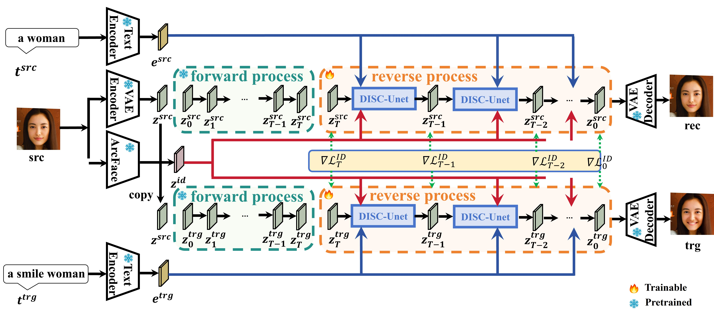
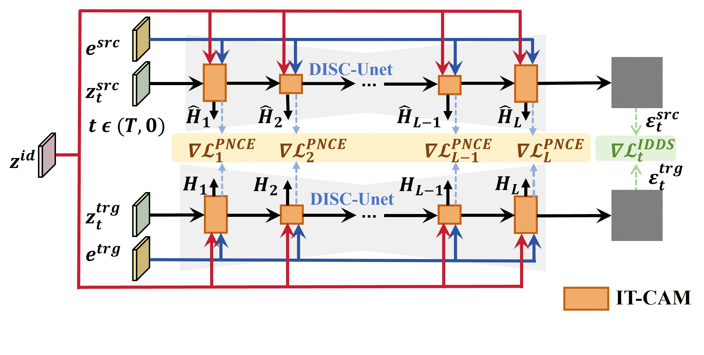
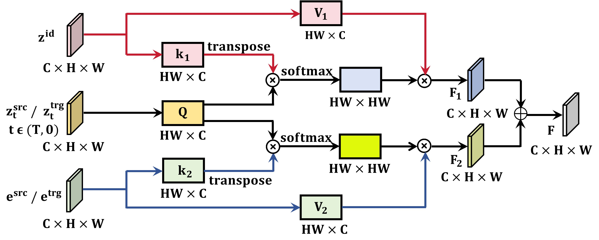
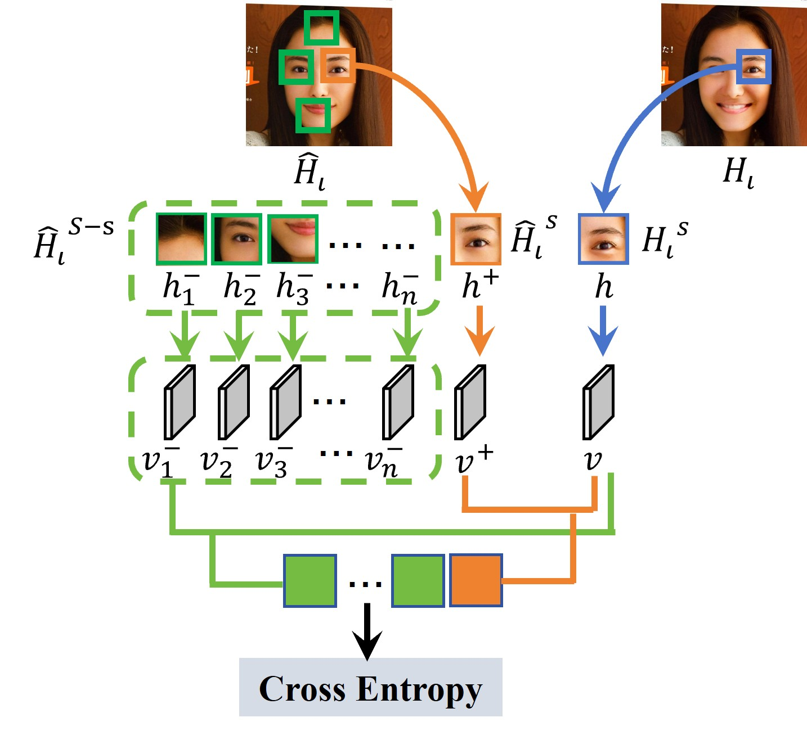

# Diffusion Model for Identity Preservation and Facial Structure Consistency in Text-Guided Face Editing

## Code is coming soon!

## 📌 Abstract

 Facial image editing has achieved significant progress in terms of generation quality and diversity. However, preserving identity and maintaining facial structure consistency remains a challenging task during text-guided facial attribute editing. This paper proposes a new diffusion model for identity preservation and facial structure consistency in text-guided face editing(DISC-Face), which is used to address these issues. Specifically, this model proposes a DISC-Unet network, in which an Identity-Text-conditioned Cross-Attention Mechanism (IT-CAM) is designed at each layer to effectively integrate identity features with textual description. To further enhance editing performance, three loss functions are proposed: an ID loss for enhancing identity preservation, a Patch Noise Contrastive Estimation (PNCE) loss for structural consistency, and an Identity Distinguishable Denoising Score (IDDS) loss that jointly considers preserving identity and maintaining facial structure consistency under text-guided conditions. Experimental results on the CelebA-HQ and FFHQ datasets demonstrate that the DISC-Face model achieves improvements of 22.6% in identity preservation, 17.7% in structural consistency, and 63.5% in generation quality while reducing perceptual artifacts by 52.8%. 

Keywords: Text-Guided Face Editing, Identity Preservation, Facial Structure Consistency, Stable Diffusion

<figure>
    
    <figcaption>Figure 1. Experimental results of the DISC-Face model on facial editing guided by
 textual descriptions with varying attribute conditions.
    </figcaption>
</figure>

## OverView

<figure>
    
    <figcaption>Figure 2. Overview of identity preservation and facial structure consistency in text
guided face editing with the DISC-FACE model.
    </figcaption>
</figure>

<figure>
    
    <figcaption>Figure 3. Overview of the DISC-Net architecture.</figcaption>
</figure>

<figure>
    
    <figcaption>Figure 4. Overview of the IT-CAM module.</figcaption>
</figure>

<figure>
    
    <figcaption>Figure 5. PNCE Loss Calculation Process.</figcaption>
</figure>

## 🚀 Environment Setup

### Clone this repository

```bash
git clone https://github.com/AnnaFace/DISC-Face.git 
cd DISC-Face
```

### Requirements

```bash
conda install pytorch==2.1.1 torchvision==0.16.1 torchaudio==2.1.1 pytorch-cuda=11.8 -c pytorch -c nvidia
pip install diffusers==0.16.1 
pip install transformers==4.32.1
```

## ⬇️  Pre-trained Diffusion Models and Datasets

We propose a new DISC-Face model based on the pretrained text-to-image [Stable Diffusion](https://github.com/CompVis/latent-diffusion), which is using the **FFHQ** or **CelebA** datasets during the inference (testing) stage.

The **FFHQ** dataset consists of 70,000 high-resolution (1024×1024) facial images, covering a wide range of variations in age, gender, ethnicity, and background. Each image is meticulously annotated with 40 facial attribute labels, such as expressions, hairstyles, and accessories.

To download the FFHQ dataset, please visit the following link:

[FFHQ Dataset](https://github.com/NVlabs/ffhq-dataset)

The **CelebA** dataset contains 202,599 celebrity facial images, each annotated with 40 binary attribute labels. Attributes include features such as smiling, wearing glasses, and having blonde hair.

To download the CelebA dataset, please visit the following link:

[CelebA Dataset](http://mmlab.ie.cuhk.edu.hk/projects/CelebA.html)

## 🎨  Usage

To perform **fine-tuning and evaluation** using our method, we provide an executable script run.py, which takes a facial image and corresponding source/target textual description as input. This script enables users to both adapt the model to specific editing tasks and evaluate its performance under controlled conditions.

The following command demonstrates how to apply **text-guided fine-tuning and attribute manipulation** on a given image:

```bash
python run.py --img_path sample/25.jpg --prompt "a woman" --trg_prompt "a smile woman" --w_cut 3.0 --patch_size 1 2 --n_patches 256
```

This script facilitates task-specific fine-tuning on individual samples while enabling a systematic evaluation of the model’s ability to preserve facial identity and structural consistency under text-conditioned transformations.
To perform fine-tuning across multiple samples, users can specify a directory containing multiple input images using the --img_path argument. The script will iteratively process each image in the specified folder, allowing batch-level evaluation for broader testing scenarios.

**Arguments:**

- `--img_path` : Path to the source image.
- `--prompt` : The textual description of the source image.
- `--trg_prompt` : The target textual description specifying desired attribute modifications.
- `--w_cut` : Weight controlling the truncation of the latent space during facial atrribute editing.
- `--patch_size` : Defines the spatial granularity used for patch-wise localized adaptation.
- `--n_patches` : Number of spatial patches used for attention-based fine-tuning.

## 🖋️ Citation

Since the paper is currently under review, please do not cite the work at this time. Once the paper is accepted for publication, we will update this repository with the appropriate citation format.

## 💜 Acknowledgement

The codebase is maintained by [Xiaoqin Xie](https://AnnaFace.github.io/). We would like to thank the authors of previous related projects for generously sharing their code, especially the [Stable Diffusion](https://github.com/CompVis/latent-diffusion), from which our code is adapted. I would like also personally thank my supervisor professor for his profound insights and discussions in the theoretical analysis.

Keywords: Text-Guided Face Editing, Identity Preservation, Facial Structure Consistency, Stable Diffusion
